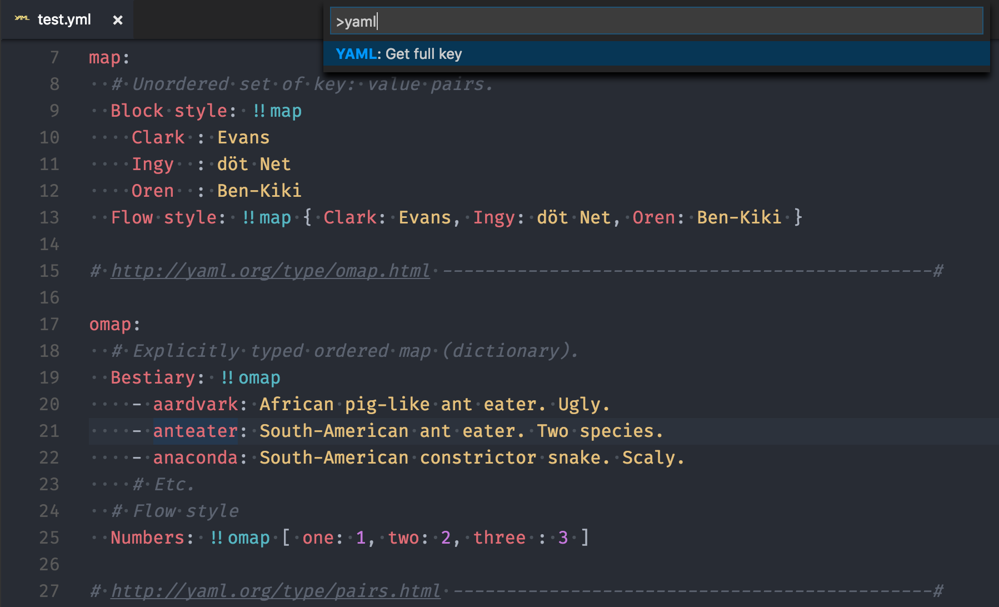
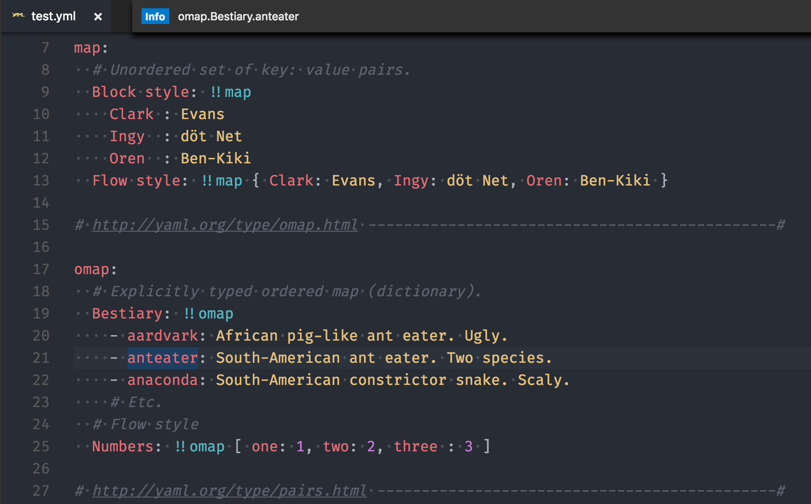

# YAML Key Viewer for Visual Studio Code

## Usage

You can use this extension to get the full path of the key where your cursor is on.

Use `Cmd-Shift-P` (Mac) or `Ctrl-Shift-P` (Windows/Linux) and choose `YAML: Get full key`

Then, it will show the full path the key where your cursor is on.

## Installation

1. Install *Visual Studio Code*
2. Launch *Code*
3. From the command palette `Ctrl-Shift-P` (Windows, Linux) or `Cmd-Shift-P` (OSX)
4. Select `Install Extension`
5. Choose the extension `YAML key viewer for Visual Studio Code`
6. Reload *Visual Studio Code*

## License
[MIT](LICENSE.md)

